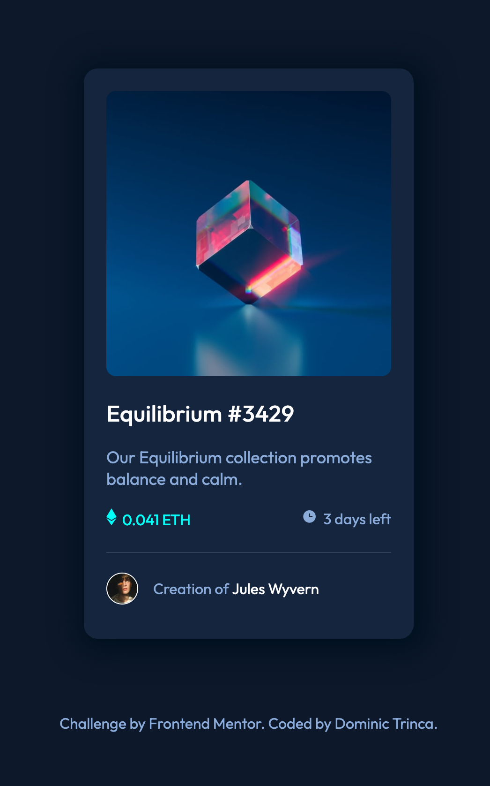

# Frontend Mentor - NFT preview card component solution

This is a solution to the [NFT preview card component challenge on Frontend Mentor](https://www.frontendmentor.io/challenges/nft-preview-card-component-SbdUL_w0U). Frontend Mentor challenges help you improve your coding skills by building realistic projects. 

## Table of contents

- [Overview](#overview)
  - [The challenge](#the-challenge)
  - [Screenshot](#screenshot)
  - [Links](#links)
- [My process](#my-process)
  - [Built with](#built-with)
  - [What I learned](#what-i-learned)
  - [Continued development](#continued-development)
  - [Useful resources](#useful-resources)
- [Author](#author)
- [Acknowledgments](#acknowledgments)

## Overview

### The challenge

Users should be able to:

- View the optimal layout depending on their device's screen size
- See hover states for interactive elements

### Screenshot

]

[comment]: <> (### Links)

[comment]: <> (- Solution URL: [Add solution URL here]&#40;https://your-solution-url.com&#41;)

[comment]: <> (- Live Site URL: [Add live site URL here]&#40;https://your-live-site-url.com&#41;)

## My process
This is my first project written using my own code. No tutorial or code-along.  
The project met a few brick walls, resulting in a re-write before completion. It's been a fantastic learning experience. 

### Built with

- HTML5
- CSS
- Flexbox/Grid. Box Model Manipulation
- Love, sweat, tears and Google. 

### What I learned
- Solidify HTMl and CSS basics 
- Focus on a workflow. Example Workflow: HTML > Style Components > layout. Not following a workflow can result in some serious spaghetti.
- It's okay to hit a brick wall, take a breather and come back with a fresh face. 
- You don't know what you don't know. Spend time learning, trying, doing, and finally googling.  

### Continued development in future projects:
- Complex CSS layouts and less reliance on margin/padding for making small adjustments to elements. 
- Working with a project that incorporates Javascript. 
- Better use of Semantic HTML tags.

### Useful resources

- [CSS-Tricks](https://css-tricks.com) - The best site on the Internet for CSS help. 
- [MDN](https://developer.mozilla.org/en-US/) - Life's not complete without MDN.

## Author

- Website - [Dominic Trinca - GitHub](https://github.com/DomskiT)
- Frontend Mentor - [DomskiT](https://www.frontendmentor.io/profile/DomskiT)

